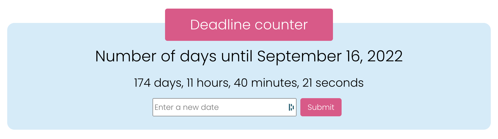

## Deadline counter

This counter calculates the time between 2 dates and uses a React state.

### Desktop version

### To do next
- Make the design responsive
- Add a visual calendar to pick-up the date